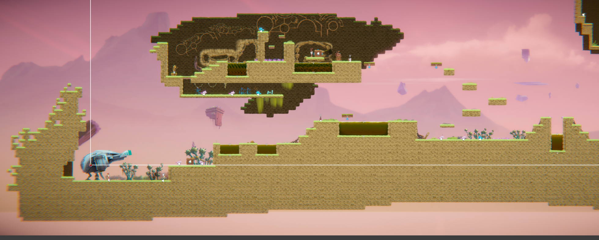

[](https://classroom.github.com/a/YyUO0xtt)
# COMP2150  - Level Design Document
### Name: [Junjing Zhang]
### Student number: [47408898] 

This document discusses and reflects on the design of your platformer level for the Level Design assessment. It should be 1500 words. Make sure you delete this and all other instructional text throughout the document before checking your word count prior to submission. Hint: You can check word count by copying this text into a Word or Google doc.

Your document must include images. To insert an image into your documentation, place it in the "DocImages" folder in this repo, then place the below text where you want the image to appear:

```

```

Example:


## 1. Player Experience (~700 words)
Outline and justify how your level design facilitates the core player experience goals outlined in the assignment spec. Each section should be supported by specific examples and screenshots of your game encounters that highlight design choices made to facilitate that particular experience.


This image is the first section in the level.
Because it is the first section, it will not be very difficult for the player to experience, this section is designed to allow players to become familiar with the gameplay of the game. My idea is to start from left to right. Players will be born on the far left side of the level and then move all the way to the right. In the process of going right, the player will get a weapon, the weapon is a close combat weapon, players need to get close to the enemy to defeat him. There are 2 types of weapons that players can get in the game, one is a close combat weapon which is one that player can get in the first section, the second one will be a ranged weapon, which is a gun, the players will get a ranged weapon later in the game. After Getting the weapon.


The player will encounter the first enemy called Chomper, Chomper is a close combat enemy, after the player goes at the range, Chomper will start to get closer and try to attack the player. Player will have 5 hp at the start if the Chomper did attack the player, the player will lose 1 hp, when the player hits the Chomper once, the Chomper will die. This part is for the player to experience how to attack the enemy, which there will encounter more enemies on the way.


After that, the player has to push the box to the right wall, and then the player can jump over the wall and then reach two acids. The player will jump over one of them to reach another land before jumping over the second acid. the player will then move forward and find a save point, there is another acid at the front, but it is very big. The player needs to jump on the moving platform above to pass the acid. In this part the player is to experience how to jump though the acid and how to use a moving platform to go thought the acid, there will be a lot of acid that the player needs to go though.


There are two ways the player can go, one way is to go down and face 2 Chomper and 1 Spitter. The player can experience a new enemy called Spitter, Spitter is a long range shooter, able to attack players within a certain distance. Another way is to go up into the cave. The cave is on the sky which the player needs to use a small portion of their parkour abilities, there will be one of the keys inside the cave which the player has to get it to be able to finish the game.


Inside the cave. There is acid, 1 Spitter and a new trap for the player which is Spikes, Spikes will cause the player to lose 1 hp. jumping all over and killing Spitter, Player cannot very see what's below, there will be 1 Spikes at the right and are acid ar the left, If the player jumps without thinking of anything, he may hit a Spikers or go in thought the acid and die. This can be regarded as a Discovery, Drama and Exploration, because players don’t know what will be next and want to find out and die.


After all the things happen, the player finally has the first key and goes down at the short way to get out the cave, to go though the short way out there is a passthrough platform for the player to enter. but there are 3 enemies waiting for the player.


There are 3 enemies and 4 Spikes there, this is a bit of a challenge, the player will have to run to a good position and jump higher than they can to pass through the spikes without getting any damage. After all, this player finally can go to the next section.


In the next section, player will enter the cave, have checkpoint 2 health and a gun waiting for player to pick up. in the new section there will be a bit more challenge design for player to play with. 


Players will use platform to jump up. This part is to let players get a little familiar with jumping, there will be many jumping mechanisms that players need to face later.


### 1.1. Discovery
What does the player learn? How does your encounter and broader level design facilitate learning in a way that follows good design practice? 

### 1.2. Drama
What is the intensity curve? How does your design facilitate increasing yet modulating intensity, with moments of tension and relief? 

### 1.3. Challenge
What are the main challenges? How have you designed and balanced these challenges to control the difficulty curve and keep the player in the flow channel?

### 1.4. Exploration
How does your level design facilitate autonomy and invite the player to explore? How do your aesthetic and layout choices create distinct and memorable spaces and/or places?

## 2. Core Gameplay (~400 words)
A section on Core Gameplay, where storyboards are used to outline how you introduce the player to each of the required gameplay elements in the first section of the game. Storyboards should follow the format provided in lectures.

Storyboards can be combined when multiple mechanics are introduced within a single encounter. Each section should include a sentence or two to briefly justify why you chose to introduce the mechanic/s to the player in that sequence.

You should restructure the headings below to match the order they appear in your level.

### 2.1. Acid

### 2.2. Checkpoints

### 2.3. Chompers

### 2.4. Health Pickups

### 2.5. Keys

### 2.6. Moving Platforms

### 2.7. Passthrough Platforms

### 2.8. Spikes

### 2.9. Spitters

### 2.10. Weapon Pickup (Gun)

### 2.11. Weapon Pickup (Staff)

## 3. Spatiotemporal Design
A section on Spatiotemporal Design, which includes your molecule diagram and annotated level maps (one for each main section of your level). These diagrams may be made digitally or by hand, but must not be created from screenshots of your game. The annotated level maps should show the structure you intend to build, included game elements, and the path the player is expected to take through the level. Examples of these diagrams are included in the level design lectures.

No additional words are necessary for this section (any words should only be within your images/diagrams).
 
### 3.1. Molecule Diagram

### 3.2. Level Map – Section 1

### 3.3.	Level Map – Section 2

### 3.4.	Level Map – Section 3

## 4. Iterative Design (~400 words)
Reflect on how iterative design helped to improve your level. Additional prototypes and design artefacts should be included to demonstrate that you followed an iterative design process (e.g. pictures of paper prototypes, early grey-boxed maps, additional storyboards of later gameplay sequences, etc.). You can also use this section to justify design changes made in Unity after you drew your level design maps shown in section 3. 

You should conclude by highlighting a specific example of an encounter, or another aspect of your level design, that could be improved through further iterative design.

## Generative AI Use Acknowledgement

Use the below table to indicate any Generative AI or writing assistance tools used in creating your document. Please be honest and thorough in your reporting, as this will allow us to give you the marks you have earnt. Place any drafts or other evidence inside this repository. This form and related evidence do not count to your word count.
An example has been included. Please replace this with any actual tools, and add more as necessary.


### Tool Used: ChatGPT
**Nature of Use** Finding relevant design theory.

**Evidence Attached?** Screenshot of ChatGPT conversation included in the folder "GenAI" in this repo.

**Additional Notes:** I used ChatGPT to try and find some more relevant design theory that I could apply to my game. After googling them, however, I found most of them were inaccurate, and some didn't exist. One theory mentioned, however, was useful, and I've incorporated it into my work.

### Tool Used: Example
**Nature of Use** Example Text

**Evidence Attached?** Example Text

**Additional Notes:** Example Text


