[](https://classroom.github.com/a/YyUO0xtt)
# COMP2150  - Level Design Document
### Name: [Junjing Zhang]
### Student number: [47408898] 

This document discusses and reflects on the design of your platformer level for the Level Design assessment. It should be 1500 words. Make sure you delete this and all other instructional text throughout the document before checking your word count prior to submission. Hint: You can check word count by copying this text into a Word or Google doc.

Your document must include images. To insert an image into your documentation, place it in the "DocImages" folder in this repo, then place the below text where you want the image to appear:

```

```

Example:


## 1. Player Experience (~700 words)
Outline and justify how your level design facilitates the core player experience goals outlined in the assignment spec. Each section should be supported by specific examples and screenshots of your game encounters that highlight design choices made to facilitate that particular experience.


This image is the first section in the level.
Because it is the first section, it will not be very difficult for the player to experience, this section is designed to allow players to become familiar with the gameplay of the game. My idea is to start from left to right. Players will be born on the far left side of the level and then move all the way to the right. 

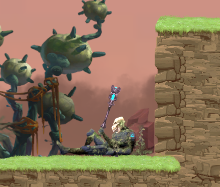 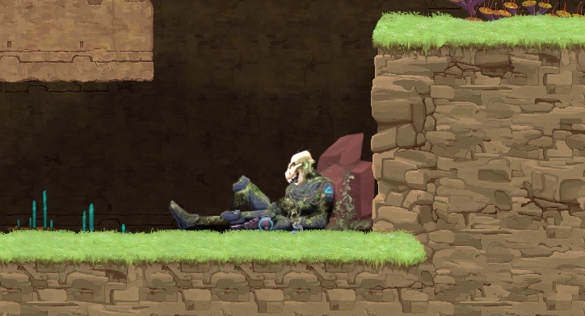
In the process of going right, the player will get a weapon, the weapon is a close combat weapon, players need to get close to the enemy to defeat him. There are 2 types of weapons that players can get in the game, one is a close combat weapon which is one that player can get in the first section, the second one will be a ranged weapon, which is a gun, the players will get a ranged weapon later in the game. 

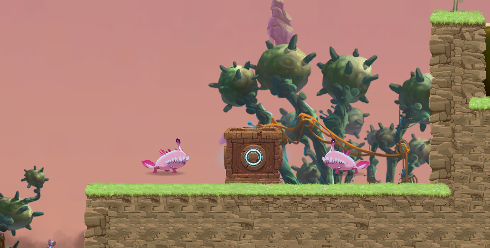
After Getting the weapon,the player will encounter the first enemy called Chomper, Chomper is a close combat enemy, after the player goes at the range, Chomper will start to get closer and try to attack the player. Player will have 5 hp at the start if the Chomper did attack the player, the player will lose 1 hp, when the player hits the Chomper once, the Chomper will die. This part is for the player to experience how to attack the enemy, which will encounter more enemies on the way.

 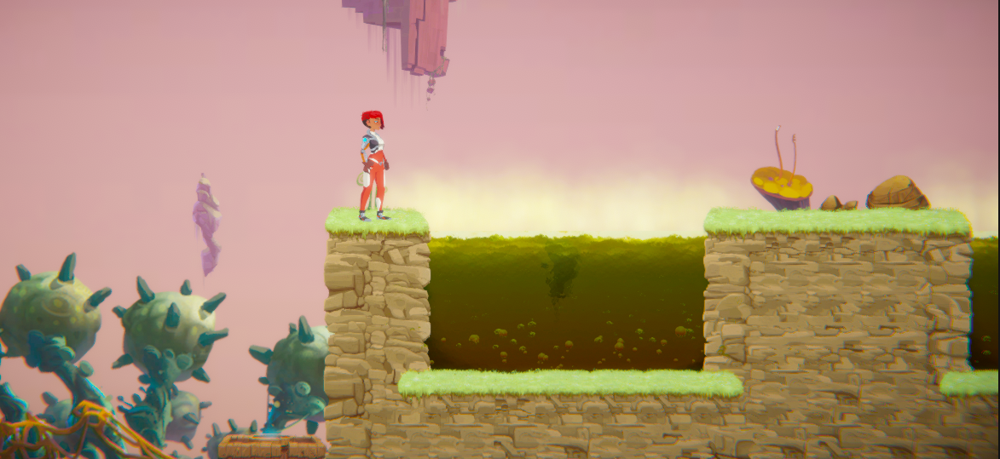 
After that, the player has to push the box to the right wall, and then the player can jump over the wall and then reach two acids. 
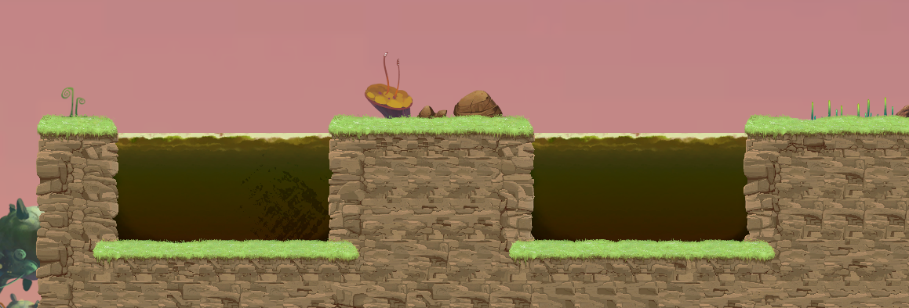 
The player will jump over one of them to reach another land before jumping over the second acid. the player will then move forward and find a save point.
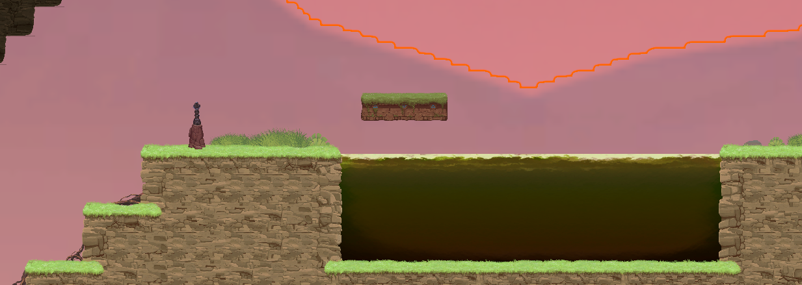
There is another acid at the front, but it is very big. The player needs to jump on the moving platform above to pass the acid. In this part the player is to experience how to jump though the acid and how to use a moving platform to go through the acid, there will be a lot of acid that the player needs to go though.

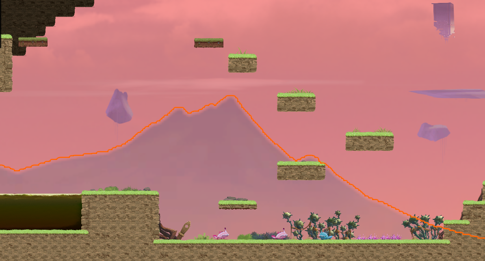
There are two ways the player can go, one way is to go down and face 2 Chomper and 1 Spitter. The player can experience a new enemy called Spitter, Spitter is a long range shooter, able to attack players within a certain distance. Another way is to go up into the cave. The cave is on the sky where the player needs to use a small portion of their parkour abilities, there will be one of the keys inside the cave which the player has to get to be able to finish the game.


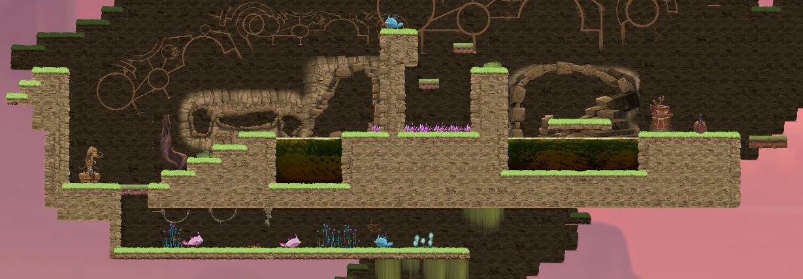
Inside the cave. There is acid, 1 Spitter and a new trap for the player which is Spikes, Spikes will cause the player to lose 1 hp. jumping all over and killing Spitter, 
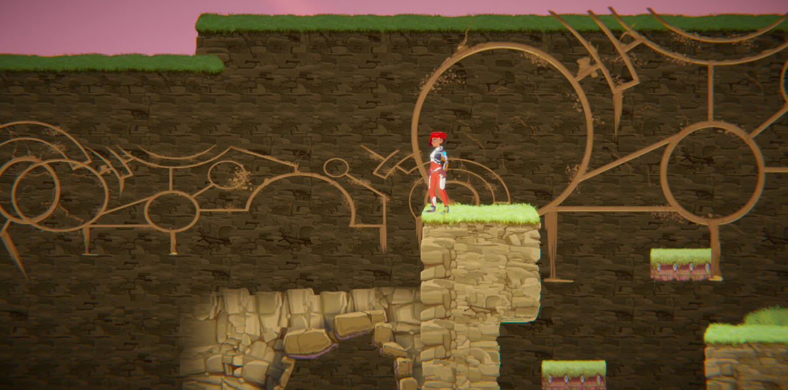
Player cannot very see what's below, there will be 1 Spikes at the right and are acid ar the left, If the player jumps without thinking of anything, he may hit a Spikers or go in thought the acid and die. This can be regarded as a Discovery, Drama and Exploration, because players don’t know what will be next and want to find out and die.

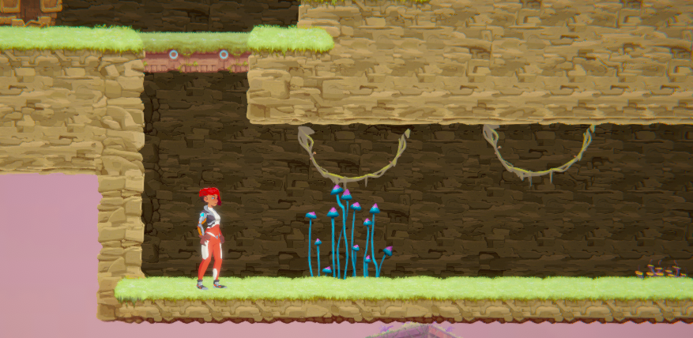
After all the things happen, the player finally has the first key and goes down at the short way to get out the cave, to go though the short way out there is a passthrough platform for the player to enter. but there are 3 enemies waiting for the player.

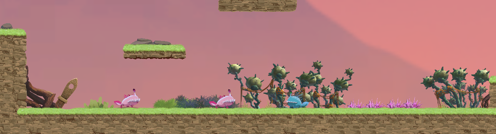
There are 2 enemies and 1 Spikes there, this is a bit of a challenge, the player will have to run to a good position and jump higher than they can to pass through the spikes without getting any damage. After all, this player finally can go to the next section.

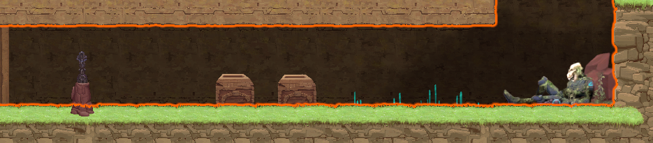
In the next section, the player will enter the cave, have checkpoint 2 health and a gun waiting for the player to pick up. In the new section there will be a bit more challenge design for the player to play with.

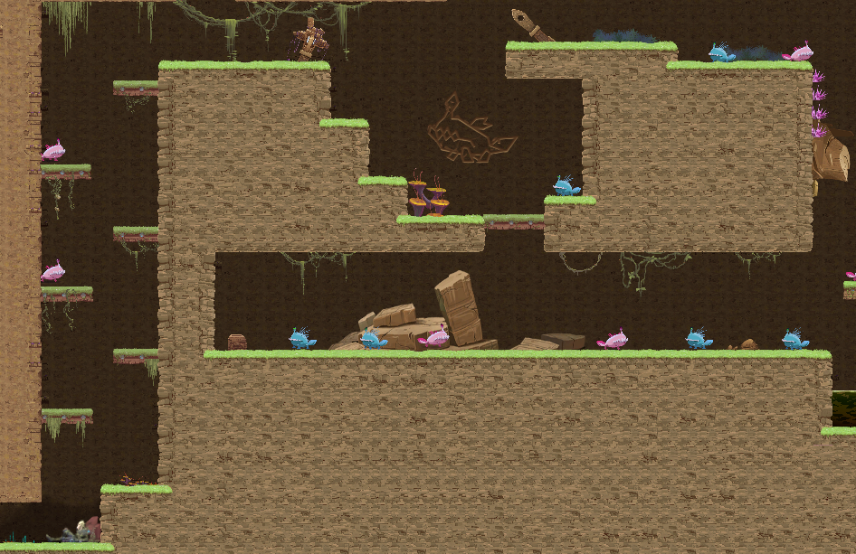
Players will use the platform to jump up. This part is to let players get a little familiar with jumping, there will be many jumping mechanisms that players need to face later. After having a gun player can shoot the enemy at a far distance, this scene is for the player to try using the gun to shoot at the spitter. After that the player will start facing 6 enemies, and the player will face an intense battle. Players need to resolve the battle quickly otherwise they will be losing, healing or dying. There will be a healing box on the left to heal the player after battle.

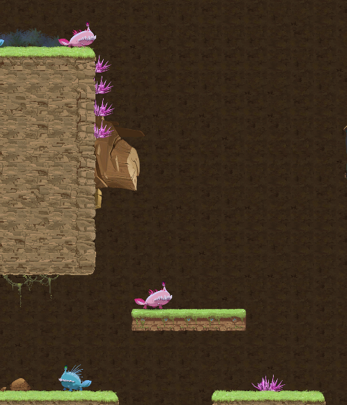
Go through the moving platform and reach the top where players will take the path to the second key. There will be many enemies, acid and spikes on the way to block the player grabbing the key. In this scene players need to use the experience learned in the first section to jump over traps and knock down enemies, of course it will be more challenging than the first section.

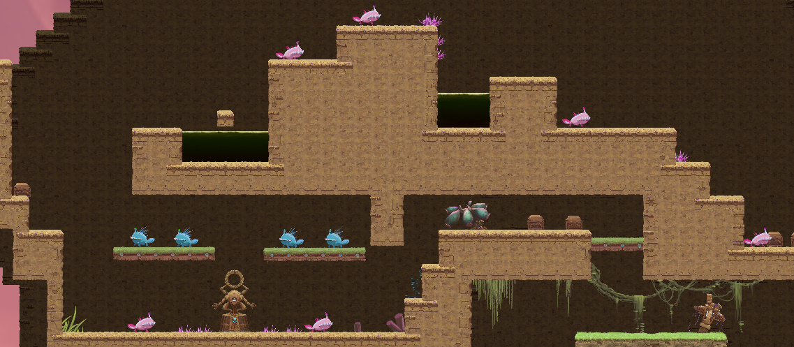
Upon reaching the location of the key, the second key will be more difficult than the first key, Here players will make good use of their jumping skills and combat skills, of course, this is not gonna be easy, there will be many enemies that will prevent you from getting the key, so the player needs to kill all the enemies as much as possible. In this case, the player can concentrate on jumping through the spikes to get the key and leave.

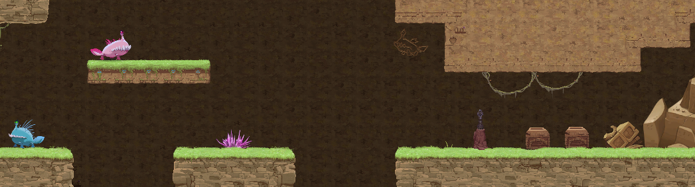 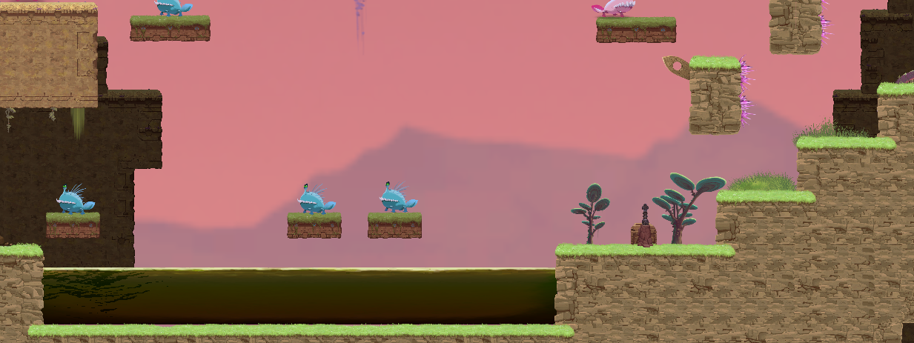
Jumping over the acid and the spikes in the middle, the player is about to enter the third section, there are many mechanisms and puzzles in this level that players need to explore and trigger.
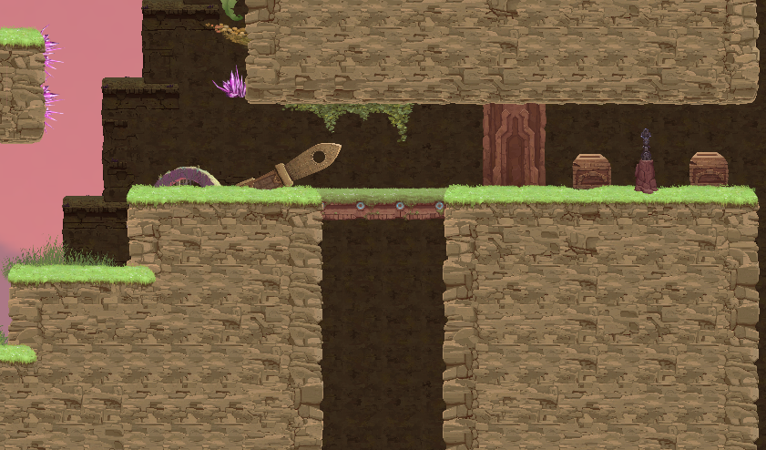
The level leading to the third key is blocked by the trigger door, player can only go down to find the switch that can open the door, 
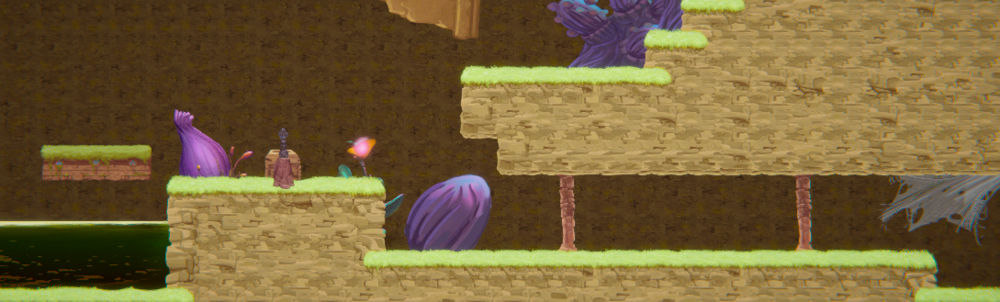
To move to the left below, the player needs to move to the right first and turn on the button. 
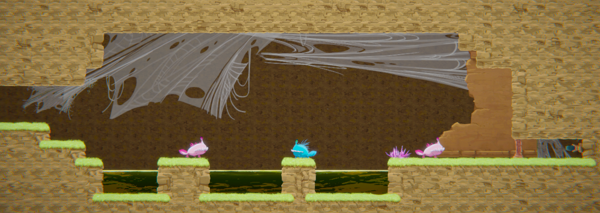
Inside the right side there are acid spikes and 3 enemies are waiting for the player. There are two lands for players inside in acid, but these two lands are smaller than the previous ones and there are monsters on them, and spike at the end of the acid, this also tests the player skills and flexibility.


After the switch has been touched, the platform on the left will start moving, so the player can go through it.
The player needs to touch the switch below first to move the bridge on the left to the left and let the box fall. Then the pressure pad can be pressed out, which can open the trigger door and make the platform move so the player can go back to the trigger door.

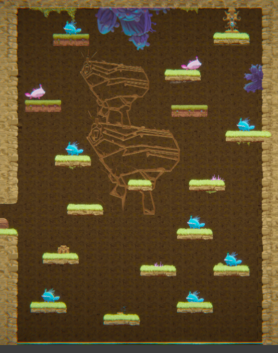
After the door is open the player will start facing the harder scene in the game, This is a rectangular level with many platforms. There will be some spikes on different platforms to block players.Players need to move up step by step and avoid monster attacks to go to the upper right corner to get the key. If you fall down while playing, there will be acid waiting for the player below. This is the scene where players need to make good use of their parkour skills and dodge abilities.

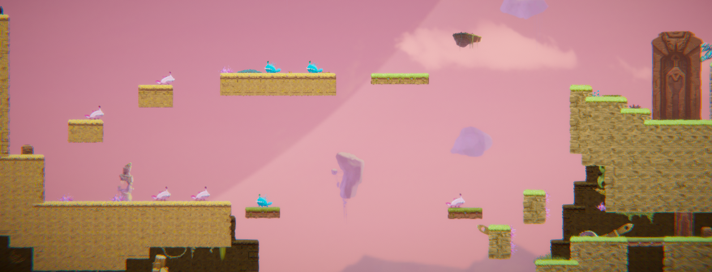
After getting all the keys, the player can go to the door and end the game. Of course, there will also be mechanisms and enemies blocking the player's progress on the way to the gate.But these mechanisms will not be as difficult as before. After passing these, there will be a gate, then the game ends.

### 1.1. Discovery
What does the player learn? How does your encounter and broader level design facilitate learning in a way that follows good design practice? 


In the first section, the player will start to discover all the basics in the game. Discover all the game mechanics and the enemies and traps that will appear in the game, for example, in the first section, I will let the players learn how to jump through the acid and the spikes, how to kill enemies, moving boxes and how to use a moving platform. In the second section the player will get a new weapon gun that is long range, allowing the player to kill the enemy from a far distance.
In the second and third section, players will encounter more difficult mechanisms later on, players need to use the experience they learned in the first section. In the third section, the player will need to explore the cave and Discover the switch to open the third key door, of course, there will be enemies and traps in each area to block the player progres。

### 1.2. Drama
What is the intensity curve? How does your design facilitate increasing yet modulating intensity, with moments of tension and relief? 


Intensity curve is usually the relationship between the intensity of challenge experienced by players in the game and the progress of the game. It is usually used to describe the difficulty in the game from high to low, and the highs and lows of difficulty in different stages of the game. There are also intensity curves in the level. The first section will have all the basic level design for the player to discover, letting the player know what mechanics will show in this level. But in the key scene, the difficulty of the game will be further increased. The second and third key scenes will be harder than the first key scene. for example In the second key scene player need to kill most of the enemy to above get the key, this won't be easy because there will be spikes between the key which player need to focus and control character will not jump over or jump too close, there will be also have enemies try to harass you not to get the key.

### 1.3. Challenge
What are the main challenges? How have you designed and balanced these challenges to control the difficulty curve and keep the player in the flow channel?

The main challenges for this level will be to find the keys, the difficulty of each key will be significantly increased, getting the key is also the most difficult part in the game. The key area has the most enemies and traps, and players need slightly higher skills and experience to get the keys.


The player will have another route when walking to the right, and that route will be the route to the key. I designed it so that players can go to the right to explore and then come back to get the key. This way I can better design and differentiate between harder areas and easier areas. The harder area will be the areas leading to the keys.


### 1.4. Exploration
How does your level design facilitate autonomy and invite the player to explore? How do your aesthetic and layout choices create distinct and memorable spaces and/or places?

In each area, I will separate the key area and the area going to the right. This will allow players to have more choices and see where to explore first which is the real way to go. In each key area, I will increase the difficulty of that area, so that players will have more curiosity and a stronger winning rate to motivate them to move forward and explore. I have placed a trigger door leading to the third area. This trigger door requires players to find a mechanism to open it. to find the mechanism. Players will lead to the underground cave, There will also be traps and enemies waiting for players in the cave.
There will be different mechanisms in this cave to open another mechanism. Players need to open multiple mechanisms to find the one that can actually open the trigger door. This gives players more exploration and more challenges, allowing players to have more fun.


## 2. Core Gameplay (~400 words)
A section on Core Gameplay, where storyboards are used to outline how you introduce the player to each of the required gameplay elements in the first section of the game. Storyboards should follow the format provided in lectures.

Storyboards can be combined when multiple mechanics are introduced within a single encounter. Each section should include a sentence or two to briefly justify why you chose to introduce the mechanic/s to the player in that sequence.

You should restructure the headings below to match the order they appear in your level.


### 2.2. Checkpoints ### 2.3. Chompers ### 2.11. Weapon Pickup (Staff)
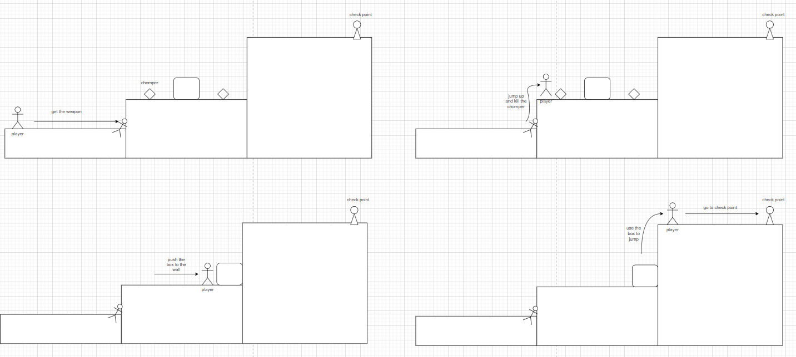
In the storyboards this is the first area that the player will be faced with. In this storyboard there are 2 types of mechanics that the player will have, that will be chomper and weapon pickup. The first player will get the weapon first, so that player is able to attack the chomper. Chompers is the enemy that player will be fighting with in game, after having the weapon, player can start jump on the jump and start attacking the chompers, jumping is one of the core gameplay in the game, there will be a lot of scenes in the game that require players to jump over, after killing all the chomper, player will start the box to the wall so the is able to jump through the wall and get to the checkpoint.

### 2.1. Acid
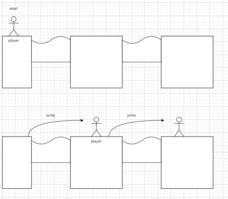
In this storyboard is the second area that the player will see in the first section. The player starts to see a new mechanic in the game, which is acid. Acid will will make the player die directly, if player touch the acid, player will respawn at the checkpoint. to go through the acid, it just need jump over, this scene was designed and used because I wanted the player to be able to adapt and jump over the acid.


### 2.6. Moving Platforms ### 2.9. Spitters
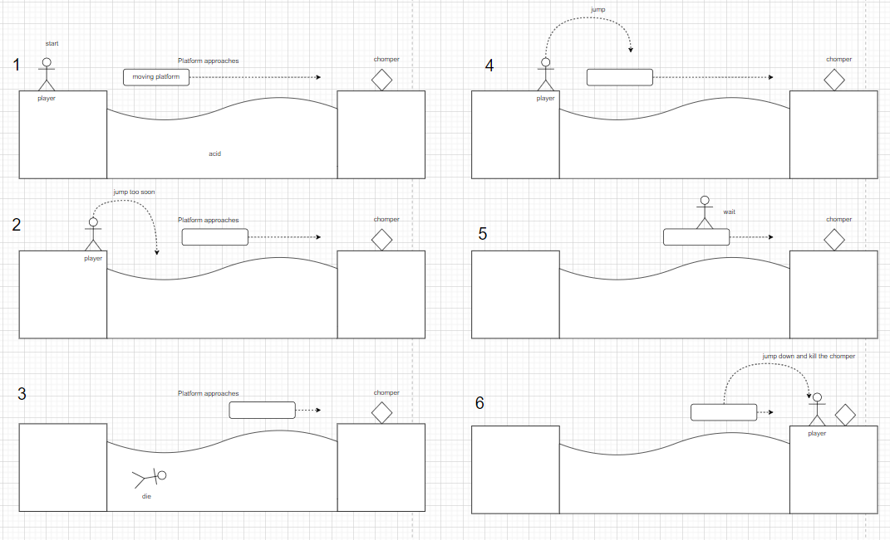
In this storyboard is the third area that player will see in the first section, there is are 2 mechanics that player will see in the game, that will be Moving Platforms and Spitters, Moving Platforms can allow the player go to more far alway area that player cannot jump or run through it. and the Spitters is the enemy that has a long attack range, this scene can let the player learn how to use a moving platform and see the new enemy called spitter.


### 2.8. Spikes
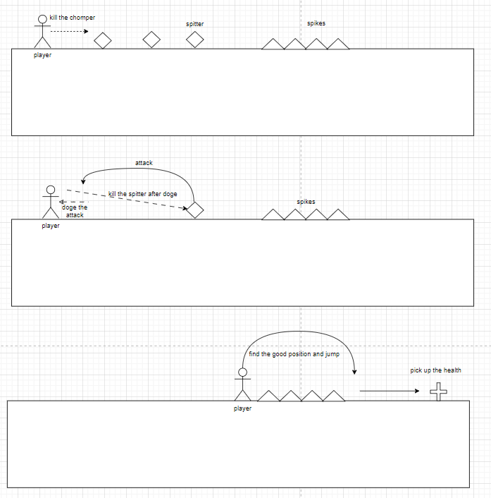
This storyboards, there are new mechanics call spikes player will first see in the game, spikes is the traps, that will stap player and lost 1 hp, it sound aright, but it is very troublesome because spikes will be at the very small area, for that player need to very careful when jump onto the small area, it is very hard to not stand on top of the spikes. In the storyboard, players kill all the enemies and start jumping through the spikes, but to jump through these long spikes, players need to stay close to the spikes and start jumping. otherwise it will lose 1 hp when jumping through it.


### 2.5. Keys ### 2.7. Passthrough Platforms
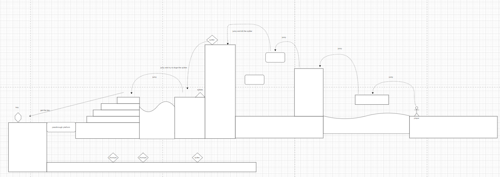  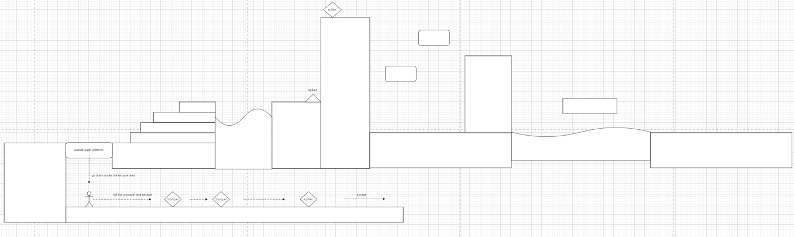
This storyboard is the area where the key is, one of the important mechanics in the game, to be open the key door and end the game, you need to have 3 keys to be able to open the door. Other mechanics will be Passthrough Platforms, Passthrough Platforms allow player to start on it and go through it, in the storyboard, player has jump through all the platform and kill the spitter on the top, after doge spikes and jump over the acid player finally get the key, after having the key, player can jump down the passthrough platform and leave the area.

### 2.10. Weapon Pickup (Gun) ### 2.4. Health Pickups
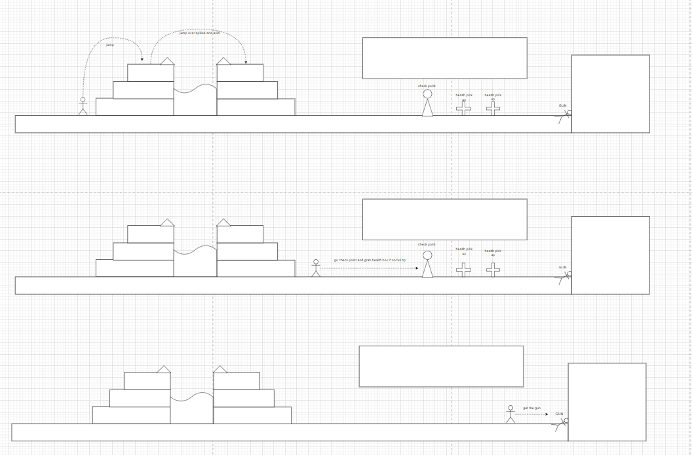
This storyboard is the last area in the first section. There are new mechanics, Health Pickups and Weapon Pickup(Gun) waiting to pick up. Health Pickups allow the player to health himself, the new weapon gun is a long attack range weapon, allowing the player to attack the enemy from a far distance.

## 3. Spatiotemporal Design
A section on Spatiotemporal Design, which includes your molecule diagram and annotated level maps (one for each main section of your level). These diagrams may be made digitally or by hand, but must not be created from screenshots of your game. The annotated level maps should show the structure you intend to build, included game elements, and the path the player is expected to take through the level. Examples of these diagrams are included in the level design lectures.

No additional words are necessary for this section (any words should only be within your images/diagrams).
 
### 3.1. Molecule Diagram
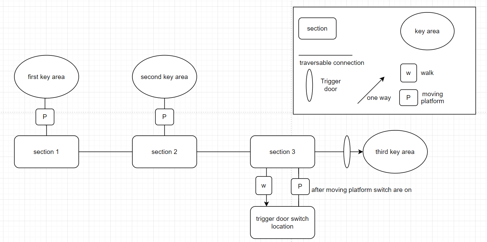

### 3.2. Level Map – Section 1
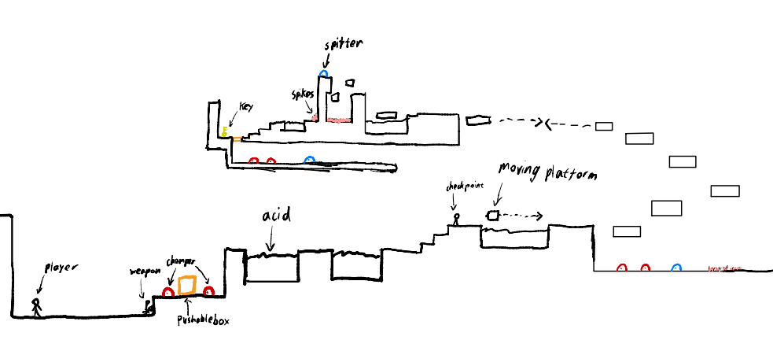
### 3.3.	Level Map – Section 2
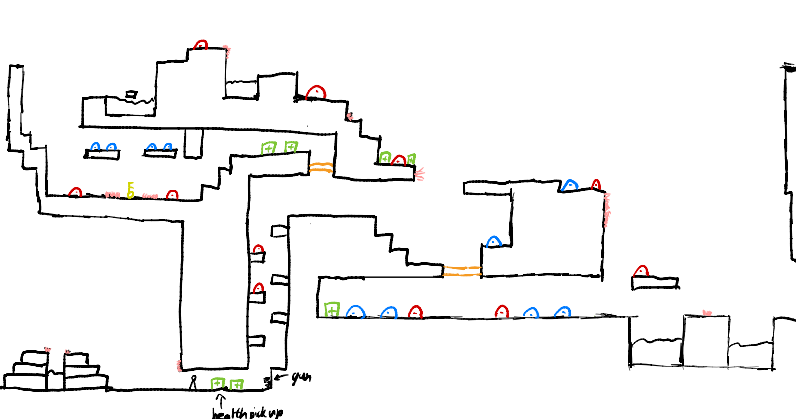
### 3.4.	Level Map – Section 3
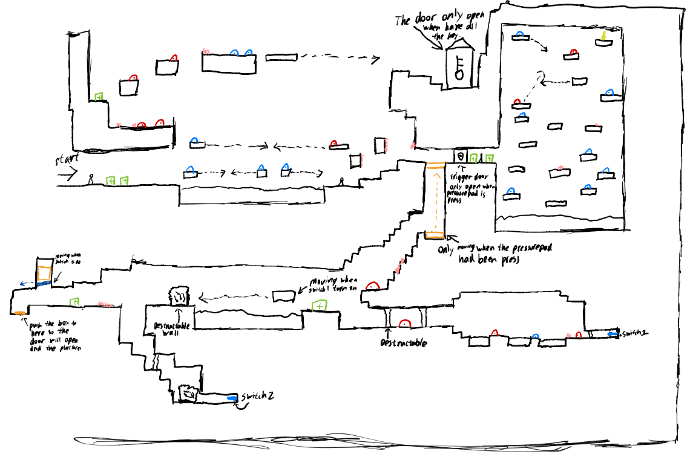
## 4. Iterative Design (~400 words)
Reflect on how iterative design helped to improve your level. Additional prototypes and design artefacts should be included to demonstrate that you followed an iterative design process (e.g. pictures of paper prototypes, early grey-boxed maps, additional storyboards of later gameplay sequences, etc.). You can also use this section to justify design changes made in Unity after you drew your level design maps shown in section 3. 

You should conclude by highlighting a specific example of an encounter, or another aspect of your level design, that could be improved through further iterative design.

Before I start using unity to create the level, first I start drawing out the level on my ipad. The reason I started drawing the level first is because personally I think drawing can make me feel actually creating and planting the idea for the level. If I miss something or change my idea I can just wipe it off and draw it again or new one, and I don't need to worry about running out of the pen or paper, I can just get a new page in the ipad and start drawing it again. Because the ipad is very light and small, I can grab the ipad with me and create the level anywhere I go. after having my drawing level done in my ipad, it time to use unity to create my level, in the way trying to implement my drawing level into unity I found out there is a lot of thing i need to change, for example in the draw I draw first section to second section is a bit too long, so I make the way first section to second section a bit short, so the player won't getting boring when walk to the second section. and in the drawing the third section has a lot of platforms. I found out that is not very necessary, too much platform will make the level easier, so I decided to take away some of the platform in the third section. After I finished creating the level, After I completed the level, I played it for a while and found that I could add more scenes to it, so I added another area in the third section, that area is the cave, that is near the trigger door in the third section. Players will need to use the switch inside to open the door above, the previous mechanism will start another mechanism closer to the door. After all this, I found the environment in the level a bit too monotonous, so I started adding the decoration, to make the level look better.


## Generative AI Use Acknowledgement

Use the below table to indicate any Generative AI or writing assistance tools used in creating your document. Please be honest and thorough in your reporting, as this will allow us to give you the marks you have earnt. Place any drafts or other evidence inside this repository. This form and related evidence do not count to your word count.
An example has been included. Please replace this with any actual tools, and add more as necessary.


### Tool Used: ChatGPT
**Nature of Use** Finding relevant design theory.

**Evidence Attached?** Screenshot of ChatGPT conversation included in the folder "GenAI" in this repo.

**Additional Notes:** I used ChatGPT to try and find some more relevant design theory that I could apply to my game. After googling them, however, I found most of them were inaccurate, and some didn't exist. One theory mentioned, however, was useful, and I've incorporated it into my work.

### Tool Used: Example
**Nature of Use** Example Text

**Evidence Attached?** Example Text

**Additional Notes:** Example Text


